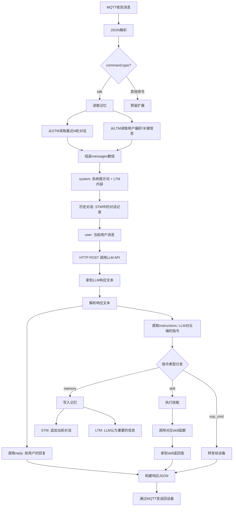
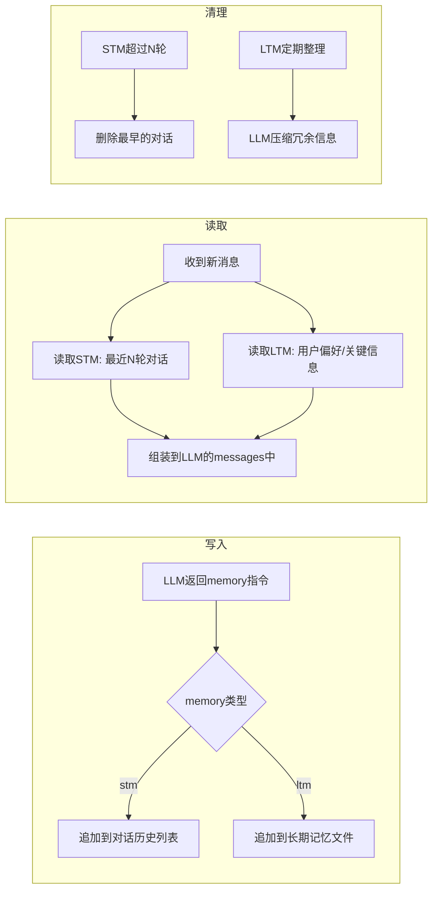
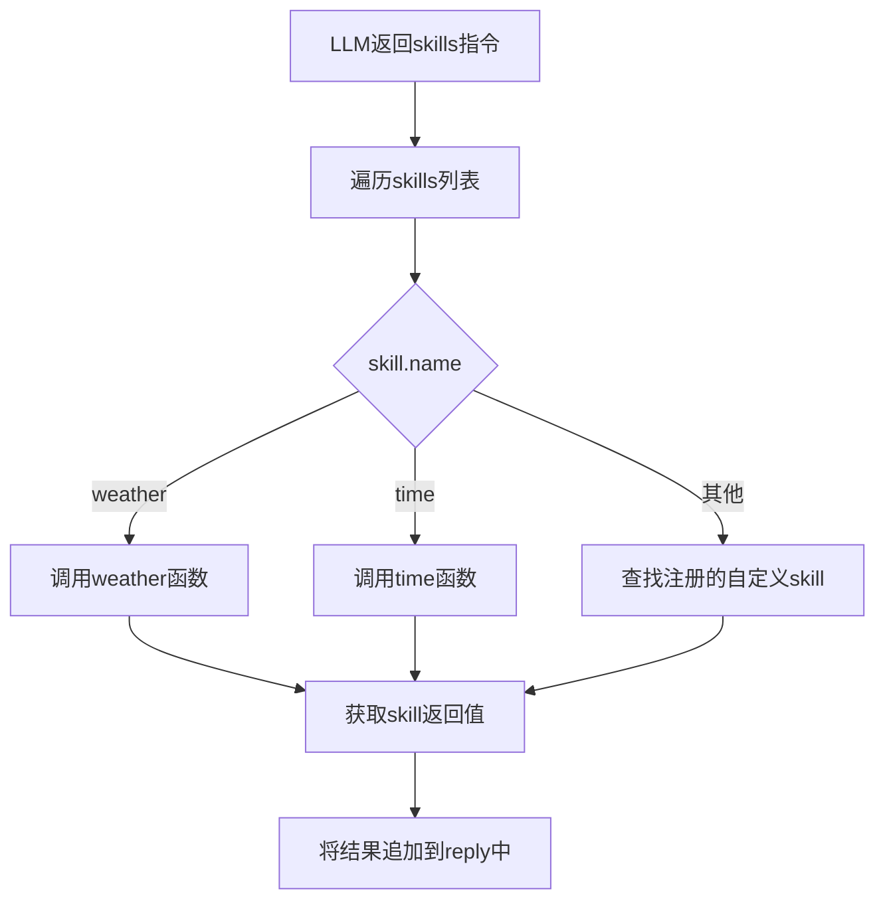
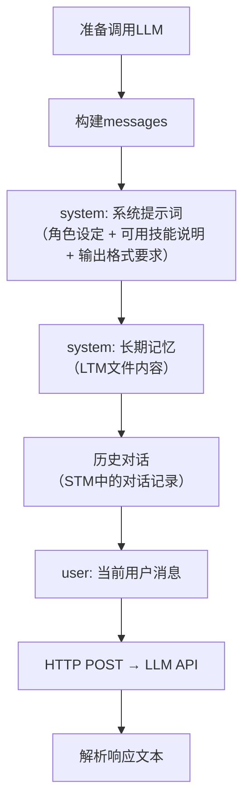
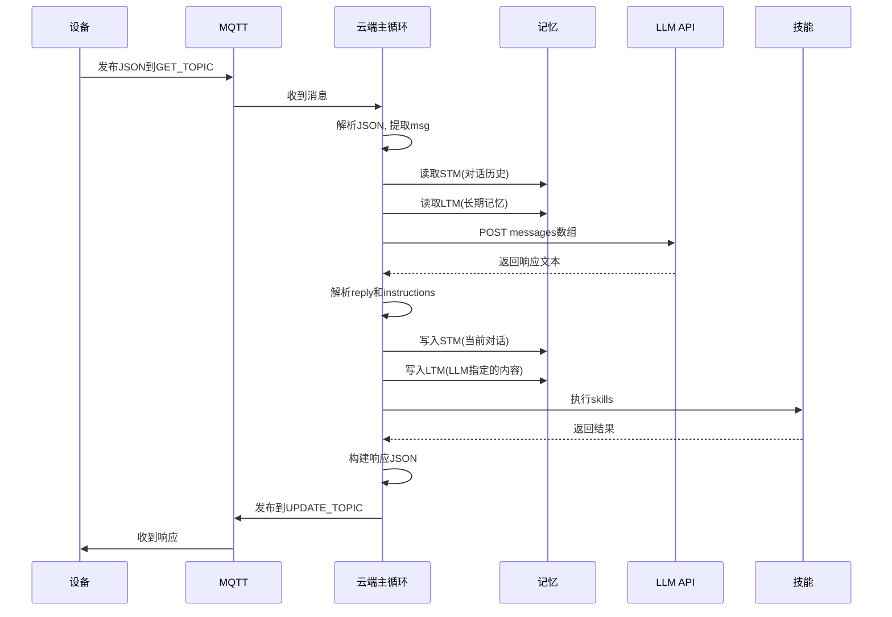

# 云端架构设计方案

## 1. 核心决策逻辑（一条消息的完整生命周期）



## 2. LLM响应格式

LLM的响应不是纯文本，而是结构化的。云端通过提示词约束LLM的输出格式：

### 2.1 LLM输出格式
```
你好！今天天气很好，阳光明媚。

```json
{
  "memory": {
    "stm": "用户问天气，回答天气好",
    "ltm": "用户关注天气"
  },
  "skills": [
    {"name": "weather", "params": {"location": "auto"}}
  ],
  "esp_cmd": {
    "skill": "expression",
    "params": {"type": "happy"}
  }
}
```
```

### 2.2 解析规则
- ```json ``` 代码块之前的内容 → `reply`（给用户的回复）
- ```json ``` 代码块内的JSON → `instructions`（LLM对云端的指令）

### 2.3 instructions字段说明
| 字段 | 类型 | 说明 |
|------|------|------|
| memory.stm | string | 写入短期记忆的内容 |
| memory.ltm | string | 写入长期记忆的内容 |
| skills | array | 云端需要执行的技能列表 |
| esp_cmd | object | 需要转发给设备执行的命令 |

## 3. 记忆系统



### 3.1 STM（短期记忆）
- **存储方式**：内存中的列表 `[{role, content}, ...]`
- **容量**：最近10轮对话
- **用途**：作为LLM的对话历史传入messages
- **清理**：超过10轮时，删除最早的

### 3.2 LTM（长期记忆）
- **存储方式**：文件 `memory-bank/ltm.md`
- **内容**：LLM认为需要长期记住的信息（用户偏好、重要事件等）
- **用途**：拼接到system prompt中
- **清理**：当文件过大时，让LLM重新整理压缩

## 4. 技能系统



### 4.1 技能注册
```python
SKILL_REGISTRY = {
    "weather": weather_skill,
    "time": time_skill,
}

def register_skill(name, func):
    SKILL_REGISTRY[name] = func
```

### 4.2 技能执行
```python
def execute_skills(skills):
    results = []
    for skill in skills:
        func = SKILL_REGISTRY.get(skill["name"])
        if func:
            result = func(skill["params"])
            results.append(result)
    return results
```

## 5. 组装LLM请求



### 5.1 messages数组结构
```python
messages = [
    {"role": "system", "content": system_prompt},      # 系统提示词
    {"role": "system", "content": ltm_content},         # 长期记忆
    {"role": "user", "content": "你好"},                # 历史对话
    {"role": "assistant", "content": "你好！"},          # 历史对话
    ...                                                  # 更多历史
    {"role": "user", "content": current_msg},           # 当前消息
]
```

## 6. 完整数据流（从设备到设备）



## 7. 模块划分（对应代码文件）

```
host/src/
├── main.py              # 主循环：MQTT消息驱动
├── config.py            # 配置：从host.env加载
├── mqtt_client.py       # MQTT：收发消息
├── json_parser.py       # JSON解析：解析设备消息
├── llm_client.py        # LLM调用：HTTP请求 + 响应解析
├── memory.py            # 记忆：STM + LTM读写
├── skill.py             # 技能：注册 + 执行
└── ui_manager.py        # 界面：命令行监控
```

### 7.1 各模块职责

| 模块 | 输入 | 输出 | 职责 |
|------|------|------|------|
| main.py | MQTT消息 | MQTT响应 | 串联所有模块的主循环 |
| config.py | host.env | 配置对象 | 加载环境变量 |
| mqtt_client.py | 主题+消息 | 收发确认 | MQTT连接和通信 |
| json_parser.py | JSON字符串 | 命令对象 | 解析设备发来的JSON |
| llm_client.py | messages数组 | reply + instructions | 调用API并解析响应 |
| memory.py | 读写请求 | 记忆内容 | STM和LTM的读写管理 |
| skill.py | skill指令 | 执行结果 | 技能注册和执行 |
| ui_manager.py | 事件 | 控制台输出 | 显示系统运行状态 |

## 8. 伪智能的实现原理

### 8.1 为什么叫"伪智能"
- 不是真正的AI推理，而是利用LLM的生成能力
- 通过精心设计的提示词，让LLM输出结构化指令
- 云端只是忠实地执行LLM的指令，本身不做决策

### 8.2 智能来源
1. **上下文连续性**：STM让LLM看到历史对话，实现连贯对话
2. **个性化**：LTM让LLM记住用户偏好，实现个性化回应
3. **技能扩展**：LLM决定何时调用什么技能，云端只负责执行
4. **记忆决策**：LLM自己决定什么该记、什么不该记

### 8.3 关键设计
- **LLM是唯一的决策者**：云端不做任何自主决策
- **云端是忠实的执行者**：解析LLM指令并执行
- **提示词是行为的核心**：改提示词 = 改行为
