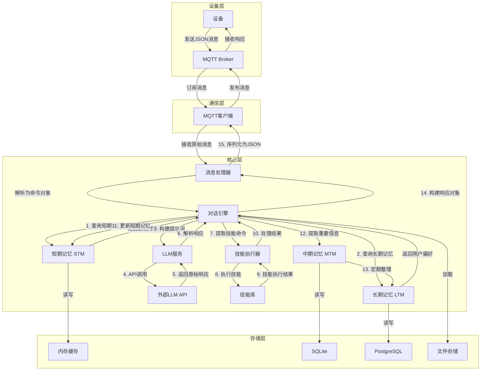
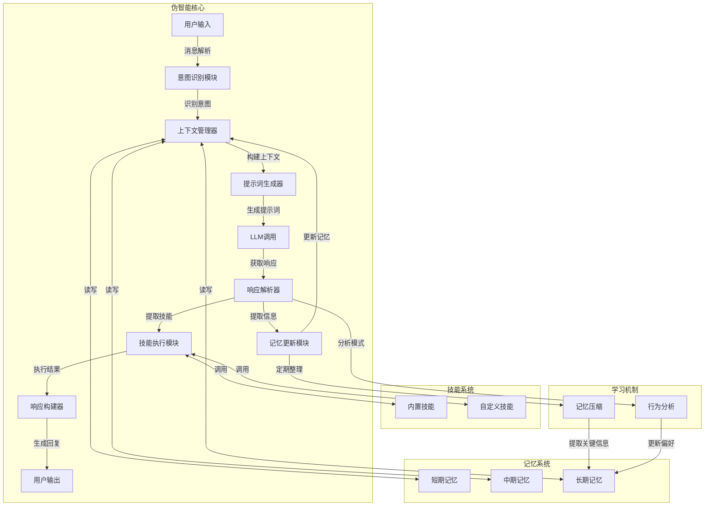

# 云端架构设计方案

## 1. 系统架构总览

```
┌───────────────────────────────────────────────────────────────────────────┐
│                           XXBot 云端系统                               │
├───────────────────────────────────────────────────────────────────────────┤
│ ┌──────────────┐  ┌──────────────┐  ┌──────────────┐  ┌──────────────┐ │
│ │   通信层     │  │   核心层     │  │   服务层     │  │   存储层     │ │
│ └──────────────┘  └──────────────┘  └──────────────┘  └──────────────┘ │
└───────────────────────────────────────────────────────────────────────────┘
```

## 2. 详细架构树状结构

### 2.1 通信层
```
├── 通信层
│   ├── MQTT客户端
│   │   ├── 连接管理
│   │   │   ├── 自动重连
│   │   │   ├── 心跳检测
│   │   │   └── 错误处理
│   │   ├── 消息订阅
│   │   │   ├── 主题管理
│   │   │   ├── 消息过滤
│   │   │   └── QoS设置
│   │   └── 消息发布
│   │       ├── 消息队列
│   │       ├── 发布确认
│   │       └── 重试机制
│   └── WebSocket服务 (可选)
│       ├── 实时通信
│       ├── 双向数据流
│       └── 会话管理
```

### 2.2 核心层
```
├── 核心层
│   ├── 消息处理器
│   │   ├── 消息接收
│   │   │   ├── MQTT消息监听
│   │   │   ├── 消息格式验证
│   │   │   └── 消息去重
│   │   ├── 消息解析
│   │   │   ├── JSON解析
│   │   │   ├── 命令识别
│   │   │   └── 数据提取
│   │   └── 消息分发
│   │       ├── 命令路由
│   │       ├── 优先级管理
│   │       └── 错误处理
│   ├── 对话引擎
│   │   ├── 上下文管理
│   │   │   ├── 对话历史维护
│   │   │   ├── 上下文压缩
│   │   │   └── 相关记忆检索
│   │   ├── LLM交互
│   │   │   ├── 提示词构建
│   │   │   ├── API调用
│   │   │   └── 响应解析
│   │   └── 意图识别
│   │       ├── 用户意图分析
│   │       ├── 情感分析
│   │       └── 主题识别
│   ├── 记忆管理器
│   │   ├── 短期记忆 (STM)
│   │   │   ├── 对话上下文
│   │   │   ├── 最近对话历史
│   │   │   └── 临时状态
│   │   ├── 中期记忆 (MTM)
│   │   │   ├── 近期重要对话
│   │   │   ├── 临时用户偏好
│   │   │   └── 会话摘要
│   │   └── 长期记忆 (LTM)
│   │       ├── 用户基本信息
│   │       ├── 长期偏好
│   │       ├── 重要事件
│   │       └── 知识存储
│   └── 技能执行器
│       ├── 技能管理
│       │   ├── 技能注册
│       │   ├── 技能发现
│       │   └── 技能版本控制
│       ├── 技能执行
│       │   ├── 技能调度
│       │   ├── 参数验证
│       │   └── 执行监控
│       └── 结果处理
│           ├── 结果格式化
│           ├── 错误处理
│           └── 反馈生成
```

### 2.3 服务层
```
├── 服务层
│   ├── LLM服务
│   │   ├── API客户端
│   │   │   ├── DeepSeek
│   │   │   ├── OpenAI
│   │   │   └── 本地模型
│   │   ├── 请求管理
│   │   │   ├── 请求构建
│   │   │   ├── 超时处理
│   │   │   └── 重试策略
│   │   └── 响应处理
│   │       ├── 响应解析
│   │       ├── 错误处理
│   │       └── 缓存管理
│   ├── 监控服务
│   │   ├── 系统监控
│   │   │   ├── CPU/内存使用
│   │   │   ├── 网络状态
│   │   │   └── 服务健康
│   │   ├── 业务监控
│   │   │   ├── 消息处理统计
│   │   │   ├── LLM调用统计
│   │   │   └── 技能执行统计
│   │   └── 告警系统
│   │       ├── 阈值监控
│   │       ├── 告警触发
│   │       └── 通知机制
│   └── 配置服务
│       ├── 配置管理
│       │   ├── 动态配置
│       │   ├── 环境分离
│       │   └── 配置版本控制
│       └── 配置加载
│           ├── 启动加载
│           ├── 运行时更新
│           └── 配置验证
```

### 2.4 存储层
```
├── 存储层
│   ├── 记忆存储
│   │   ├── 短期记忆
│   │   │   ├── 内存缓存
│   │   │   ├── Redis
│   │   │   └── 会话存储
│   │   ├── 中期记忆
│   │   │   ├── SQLite
│   │   │   ├── 定期清理
│   │   │   └── 索引优化
│   │   └── 长期记忆
│   │       ├── PostgreSQL
│   │       ├── 关系型存储
│   │       └── 全文搜索
│   ├── 文件存储
│   │   ├── 系统提示
│   │   ├── 提示模板
│   │   ├── 技能定义
│   │   └── 日志文件
│   └── 缓存系统
│       ├── LLM响应缓存
│       ├── 记忆检索缓存
│       └── 技能执行缓存
```

## 3. 组件关联与数据流

### 3.1 核心数据流（详细版）



### 3.2 伪智能实现原理



### 3.3 组件关联详情

#### 3.3.1 通信层与核心层
- **MQTT客户端** → **消息处理器**：
  - 传递接收到的MQTT消息
  - 接收需要发送的响应消息

#### 3.3.2 核心层内部
- **消息处理器** → **对话引擎**：
  - 传递解析后的命令和数据
  - 接收构建的响应

- **对话引擎** → **记忆管理器**：
  - 查询相关记忆和上下文
  - 更新新的记忆内容

- **对话引擎** → **LLM服务**：
  - 传递构建的提示词和上下文
  - 接收LLM生成的响应

- **对话引擎** → **技能执行器**：
  - 传递提取的技能命令
  - 接收技能执行结果

#### 3.3.3 核心层与服务层
- **对话引擎** → **LLM服务**：
  - 调用LLM API进行对话处理

- **所有组件** → **监控服务**：
  - 发送运行状态和统计数据
  - 接收告警和通知

- **所有组件** → **配置服务**：
  - 加载和更新配置

#### 3.3.4 核心层与存储层
- **记忆管理器** → **记忆存储**：
  - 读写不同类型的记忆数据

- **对话引擎** → **文件存储**：
  - 加载系统提示和模板

- **所有组件** → **缓存系统**：
  - 读写缓存数据提高性能

## 4. 关键流程详解

### 4.1 对话处理流程

1. **消息接收**：
   - MQTT客户端从Broker接收设备消息
   - 消息处理器验证消息格式

2. **命令解析**：
   - 消息处理器解析JSON格式
   - 识别命令类型（如talk）
   - 提取命令数据

3. **上下文构建**：
   - 对话引擎从短期记忆获取最近对话
   - 从长期记忆获取用户偏好
   - 构建包含历史对话的上下文

4. **意图识别**：
   - 分析用户意图
   - 识别情感倾向
   - 确定对话主题

5. **LLM调用**：
   - 构建包含系统提示、记忆和上下文的提示词
   - LLM服务调用外部API
   - 处理API响应

6. **响应处理**：
   - 解析LLM响应
   - 提取技能命令
   - 构建回复内容

7. **技能执行**：
   - 技能执行器执行提取的技能
   - 处理技能执行结果
   - 整合技能执行结果到回复中

8. **记忆更新**：
   - 更新短期记忆（最近对话）
   - 提取重要信息到中期记忆
   - 定期将重要信息整理到长期记忆

9. **响应发送**：
   - 消息处理器构建响应JSON
   - MQTT客户端发送回设备

### 4.2 记忆管理流程

1. **记忆写入**：
   - **短期记忆**：实时更新对话内容，保留最近5-10轮对话
   - **中期记忆**：定期从短期记忆中提取重要信息，保留最近24小时的内容
   - **长期记忆**：从中期记忆中提取关键信息，永久存储

2. **记忆读取**：
   - **对话上下文**：加载最近的对话历史
   - **相关记忆**：根据当前话题检索相关信息
   - **个性化信息**：加载用户偏好和习惯

3. **记忆压缩**：
   - **短期记忆**：超过容量时移除最早的对话
   - **中期记忆**：定期清理过期数据，提取摘要
   - **长期记忆**：优化存储结构，建立索引

### 4.3 伪智能实现流程

1. **上下文理解**：
   - 维护对话历史
   - 关联相关记忆
   - 理解当前语境

2. **个性化回应**：
   - 基于用户历史偏好
   - 考虑用户情感状态
   - 调整回应风格

3. **技能调用**：
   - 识别需要执行的技能
   - 传递正确的参数
   - 整合技能执行结果

4. **学习机制**：
   - 分析用户行为模式
   - 提取重要信息到长期记忆
   - 优化回应策略

## 5. 系统特性与优势

### 5.1 模块化设计
- **松耦合**：各组件独立运行，易于维护
- **可扩展性**：支持添加新功能和技能
- **可测试性**：每个组件可单独测试

### 5.2 智能特性
- **上下文理解**：保持对话连贯性
- **记忆管理**：存储和利用历史信息
- **技能扩展**：支持多种内置和自定义技能
- **个性化**：根据用户偏好调整回应

### 5.3 性能优化
- **缓存机制**：减少重复计算和API调用
- **并行处理**：提高消息处理效率
- **资源管理**：优化内存和CPU使用

### 5.4 可靠性
- **错误处理**：完善的异常捕获和处理
- **重连机制**：MQTT连接自动恢复
- **监控告警**：实时监控系统状态

## 6. 技术实现要点

### 6.1 核心技术栈
- **后端**：Python 3.10+
- **通信**：paho-mqtt, websockets
- **存储**：Redis, SQLite, PostgreSQL
- **LLM**：requests (API调用)
- **监控**：prometheus-client, logging

### 6.2 目录结构
```
host/
├── src/
│   ├── core/                # 核心模块
│   │   ├── message_handler.py    # 消息处理器
│   │   ├── dialogue_engine.py    # 对话引擎
│   │   ├── memory_manager.py     # 记忆管理器
│   │   └── skill_executor.py     # 技能执行器
│   ├── services/            # 服务模块
│   │   ├── llm_service.py        # LLM服务
│   │   ├── monitoring_service.py # 监控服务
│   │   └── config_service.py     # 配置服务
│   ├── skills/              # 技能模块
│   │   ├── base_skill.py         # 技能基类
│   │   ├── builtin/              # 内置技能
│   │   └── custom/               # 自定义技能
│   ├── storage/             # 存储模块
│   │   ├── memory_store.py       # 记忆存储
│   │   ├── file_store.py         # 文件存储
│   │   └── cache.py              # 缓存系统
│   ├── main.py              # 主入口
│   └── mqtt_client.py       # MQTT客户端
├── data/                    # 数据目录
│   ├── memory/              # 记忆数据
│   │   ├── stm/             # 短期记忆
│   │   ├── mtm/             # 中期记忆
│   │   └── ltm/             # 长期记忆
│   ├── skills/              # 技能数据
│   └── logs/                # 日志数据
├── host-llm/                # LLM相关
│   ├── system_prompt.md     # 系统提示
│   └── prompts/             # 提示模板
├── memory-bank/             # 记忆库
│   ├── personality.md       # 性格特征
│   ├── ltm.md               # 长期记忆
│   └── stm/                 # 短期记忆
└── host.env                 # 环境配置
```

## 7. 实现路径

### 7.1 第一阶段：基础架构搭建
1. **核心模块重构**：
   - 消息处理器
   - 对话引擎
   - 记忆管理器
   - 技能执行器

2. **存储系统实现**：
   - 短期记忆（内存缓存）
   - 中期记忆（SQLite）
   - 长期记忆（PostgreSQL）

3. **服务层搭建**：
   - LLM服务
   - 监控服务
   - 配置服务

### 7.2 第二阶段：智能功能增强
1. **上下文管理**：
   - 对话历史维护
   - 记忆检索优化
   - 上下文压缩算法

2. **技能系统**：
   - 技能注册机制
   - 内置技能实现
   - 技能执行框架

3. **记忆系统**：
   - 记忆压缩算法
   - 记忆关联检索
   - 记忆优先级管理

### 7.3 第三阶段：性能优化与扩展
1. **性能优化**：
   - 缓存策略优化
   - 并行处理
   - 资源使用优化

2. **功能扩展**：
   - 新技能开发
   - Web控制台
   - 数据分析工具

3. **部署优化**：
   - 容器化部署
   - 负载均衡
   - 高可用性

## 8. 伪智能实现细节

### 8.1 上下文理解
- **对话历史**：维护最近5-10轮对话
- **话题追踪**：识别对话主题和子主题
- **指代消解**：理解代词和指称关系
- **情感分析**：识别用户情感状态

### 8.2 记忆系统
- **短期记忆**：
  - 存储最近对话（5-10轮）
  - 使用内存缓存，速度快
  - 会话结束后清理

- **中期记忆**：
  - 存储最近24小时的重要对话
  - 使用SQLite，持久化存储
  - 定期整理和压缩

- **长期记忆**：
  - 存储用户偏好、重要事件
  - 使用PostgreSQL，支持复杂查询
  - 建立索引，提高检索速度

### 8.3 技能系统
- **内置技能**：
  - 天气查询
  - 时间查询
  - 设备控制
  - 信息查询

- **自定义技能**：
  - 技能注册机制
  - 技能开发SDK
  - 技能市场

### 8.4 学习机制
- **行为分析**：
  - 分析用户对话模式
  - 识别用户偏好
  - 预测用户需求

- **记忆优化**：
  - 自动提取关键信息
  - 定期整理记忆结构
  - 优化记忆检索

- **响应优化**：
  - 根据用户反馈调整回应
  - 学习用户的语言风格
  - 个性化回应策略

## 9. 结论

本架构设计通过树状结构清晰划分了系统的各个组件，并详细说明了组件之间的关联和数据流。特别是通过详细的mermaid图展示了伪智能的实现原理，包括上下文管理、记忆系统、技能执行和学习机制。

核心优势在于：
1. **清晰的层次结构**：从通信层到存储层的完整架构
2. **详细的组件关联**：详细的数据流和调用关系
3. **伪智能实现**：上下文理解、记忆管理和学习机制
4. **可扩展性**：模块化设计便于功能扩展
5. **性能优化**：缓存机制和并行处理

该架构不仅满足当前的伪智能需求，也为未来的功能增强和性能优化提供了良好的基础。通过这种设计，机器人系统将能够理解上下文、保持对话连贯性、管理记忆并执行各种技能，从而实现更智能的交互体验。