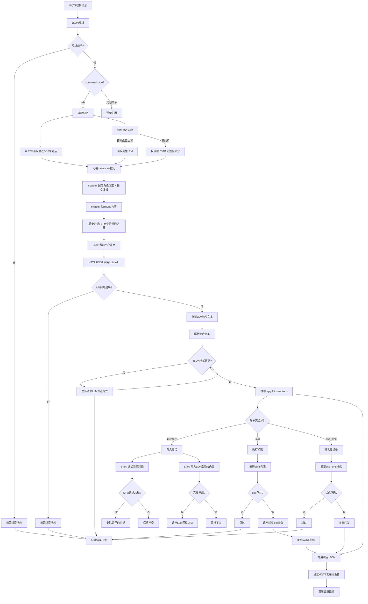

# 核心决策逻辑（完善版）

## 1. 一条消息的完整生命周期



## 2. 详细步骤说明

### 2.1 消息接收与解析
1. **MQTT消息接收**：
   - 订阅 `MQTT_GET_TOPIC` 主题
   - 收到消息后立即记录时间戳和主题

2. **JSON解析**：
   - 使用 `json.loads()` 解析消息体
   - 验证必须字段：`object`, `command.type`, `command.data`
   - 错误处理：JSON格式错误或字段缺失时，返回错误响应

3. **命令类型判断**：
   - 目前只处理 `talk` 命令
   - 其他命令类型暂时返回预留响应

### 2.2 记忆读取（优化版）
1. **STM读取**：
   - 从内存中的 `stm_messages` 列表读取最近5-10轮对话
   - 格式：`[{"role": "user", "content": "..."}, {"role": "assistant", "content": "..."}]`

2. **LTM读取策略**：
   - **首轮对话**：读取完整LTM内容
   - **每10轮对话**：重新读取完整LTM内容
   - **其他轮次**：只读取LTM的核心性格部分（前500-1000字符）

3. **分层记忆**：
   - `personality.md`：固定的性格描述（每次都读取）
   - `ltm.md`：动态的用户偏好和重要信息（选择性读取）

### 2.3 LLM调用
1. **messages组装**：
   - `system` 角色1：固定角色设定 + personality.md内容
   - `system` 角色2：动态LTM内容（根据轮次选择性读取）
   - 历史对话：STM中的对话记录
   - `user` 角色：当前用户消息

2. **HTTP POST请求**：
   - 调用配置的 `LLM_BASE_URL`
   - 超时设置：30秒
   - 重试机制：失败后重试1次

3. **响应处理**：
   - 检查HTTP状态码
   - 解析JSON响应，提取 `choices[0].message.content`

### 2.4 响应解析（容错版）
1. **格式验证**：
   - 检查是否包含 ` ```json ``` ` 代码块
   - 验证JSON格式是否正确

2. **格式容错**：
   - 当JSON解析失败时，重新请求LLM修正格式
   - 最多尝试3次
   - 超过尝试次数后返回错误响应

3. **字段提取**：
   - `reply`：代码块之前的内容
   - `instructions`：代码块内的JSON

4. **指令验证**：
   - 验证 `instructions` 中的字段类型
   - 处理缺失字段的情况

### 2.5 指令执行
1. **记忆指令**：
   - `memory.stm`：追加到STM列表
   - `memory.ltm`：追加到LTM文件
   - STM容量控制：超过10轮时删除最早的
   - LTM压缩：文件超过10KB时，调用LLM压缩

2. **技能指令**：
   - 遍历 `skills` 列表
   - 查找 `SKILL_REGISTRY` 中的对应函数
   - 调用函数并传递参数
   - 收集执行结果

3. **设备指令**：
   - 验证 `esp_cmd` 格式
   - 准备转发给设备的命令

### 2.6 响应构建与发送
1. **响应JSON构建**：
   - 格式：`{"object": "host", "time": "...", "command": {"type": "talk", "data": {"msg": "...", "skills": [...], "esp_cmd": {...}}}`
   - 包含 `reply`、技能执行结果和设备指令

2. **MQTT发送**：
   - 发布到 `MQTT_UPDATE_TOPIC` 主题
   - QoS：1（至少一次）
   - 等待发布确认

3. **监控更新**：
   - 增加消息处理计数
   - 记录处理时间
   - 更新成功率统计

## 3. 错误处理机制

| 错误类型 | 处理方式 | 响应内容 |
|---------|---------|---------|
| JSON解析错误 | 返回错误响应 | `{"error": "Invalid JSON format"}` |
| 字段缺失 | 返回错误响应 | `{"error": "Missing required fields"}` |
| LLM API调用失败 | 返回错误响应 | `{"error": "LLM service error"}` |
| LLM响应格式错误 | 重新请求LLM | 最多尝试3次 |
| 技能执行失败 | 记录错误，继续执行 | 技能结果为空 |
| MQTT发送失败 | 记录错误，重试 | 无响应 |

## 4. 性能优化

1. **缓存机制**：
   - LTM内容缓存：避免频繁读取文件
   - 技能结果缓存：相同参数的技能调用直接返回缓存结果

2. **并发处理**：
   - 技能执行可以并行处理
   - MQTT消息处理使用队列，避免阻塞

3. **资源管理**：
   - STM使用固定大小的列表
   - LTM定期压缩，避免文件过大

4. **网络优化**：
   - LLM API请求使用连接池
   - 合理设置超时时间

## 5. 安全考虑

1. **输入验证**：
   - 验证所有来自设备的输入
   - 防止注入攻击

2. **API密钥保护**：
   - LLM API密钥从环境变量读取
   - 不在代码中硬编码

3. **消息加密**：
   - MQTT使用TLS加密
   - 敏感信息传输加密

4. **权限控制**：
   - 限制技能执行权限
   - 验证设备身份

## 6. 监控指标

| 指标 | 说明 | 收集频率 |
|------|------|----------|
| 消息处理计数 | 处理的消息数量 | 每次处理 |
| 处理时间 | 消息处理的平均时间 | 每次处理 |
| 成功率 | 成功处理的消息比例 | 每100条消息 |
| LLM调用次数 | LLM API调用次数 | 每次调用 |
| LLM响应时间 | LLM API响应的平均时间 | 每次调用 |
| 技能执行次数 | 技能执行的次数 | 每次执行 |
| 错误率 | 错误发生的比例 | 每100条消息 |

## 7. 扩展性考虑

1. **命令扩展**：
   - 预留 `command.type` 其他值的处理逻辑
   - 支持添加新的命令类型

2. **技能扩展**：
   - 提供 `register_skill()` 函数注册新技能
   - 支持动态加载技能模块

3. **LLM扩展**：
   - 支持切换不同的LLM提供商
   - 支持本地模型

4. **存储扩展**：
   - 支持Redis等缓存存储STM
   - 支持数据库存储LTM

## 8. 代码实现要点

### 8.1 核心函数

```python
def handle_mqtt_message(client, userdata, msg):
    # 1. 解析JSON
    # 2. 读取记忆（根据轮次选择性读取）
    # 3. 调用LLM
    # 4. 解析响应（带容错）
    # 5. 执行指令
    # 6. 构建响应
    # 7. 发送MQTT
    pass

def call_llm(messages):
    # 1. 构建请求
    # 2. 发送HTTP POST
    # 3. 处理响应
    # 4. 解析结果
    pass

def parse_llm_response(response_text):
    # 1. 提取reply
    # 2. 提取instructions
    # 3. 验证格式（带容错）
    pass

def execute_instructions(instructions):
    # 1. 处理memory指令
    # 2. 处理skill指令
    # 3. 处理esp_cmd指令
    pass
```

### 8.2 数据结构

```python
# STM结构
stm_messages = [
    {"role": "user", "content": "你好"},
    {"role": "assistant", "content": "你好！"},
    # ... 更多对话
]

# 分层LTM结构
# memory-bank/personality.md（固定性格）
"""
角色设定：
- 名字：小助手
- 性格：开朗、友善、乐于助人
- 语言风格：口语化、亲切
- 行为准则：保持专业，保护用户隐私
"""

# memory-bank/ltm.md（动态信息）
"""
用户偏好：
- 喜欢天气话题
- 作息规律
- 对科技感兴趣

重要事件：
- 2026年4月12日：首次使用系统
"""

# LLM响应格式
"""
你好！今天天气很好，阳光明媚。

```json
{
  "memory": {
    "stm": "用户问天气，回答天气好",
    "ltm": "用户关注天气"
  },
  "skills": [
    {"name": "weather", "params": {"location": "auto"}}
  ],
  "esp_cmd": {
    "skill": "expression",
    "params": {"type": "happy"}
  }
}
```
"""
```

### 8.3 配置项

| 配置项 | 说明 | 默认值 |
|--------|------|--------|
| LLM_BASE_URL | LLM API地址 | - |
| LLM_API_KEY | LLM API密钥 | - |
| LLM_MODEL | LLM模型名称 | - |
| LLM_TEMPERATURE | LLM温度参数 | 0.7 |
| LLM_MAX_TOKENS | LLM最大token数 | 2000 |
| STM_MAX_MESSAGES | STM最大消息数 | 10 |
| LTM_MAX_SIZE | LTM最大文件大小 | 10KB |
| LTM_CORE_SIZE | LTM核心性格部分大小 | 1000 |
| LTM_FULL_READ_INTERVAL | 完整读取LTM的间隔 | 10 |
| MQTT_GET_TOPIC | MQTT接收主题 | - |
| MQTT_UPDATE_TOPIC | MQTT发送主题 | - |
